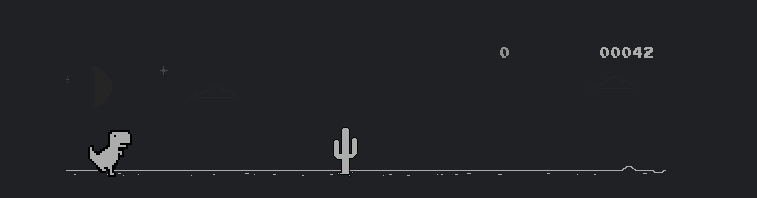

# Builderz > Dino (Project 1.3)

<p align="center">
  
</p>

dino game from scratch made with C++ - Builderz Project 1.3.

**Features:**
- CMake-based C++ project.
- raylib UI .
- Uses `raylib`.

**Build**

First time only, configure the project:

```bash
cmake -S . -B build
```

After that, the build command is:

```bash
cmake --build build
```

**Run**

```bash
./build/DinoGame
```

If you are building for the first time, CMake will fetch `raylib` during the configure step.

**How to play**

- Press space to play.

**Contribute**

Want to contribute or to add more? Fork this repo and  submit a PR.

**Join Builderz?**
 
Telegram : https://t.me/+20bm-nYA7Fc5ODA0

